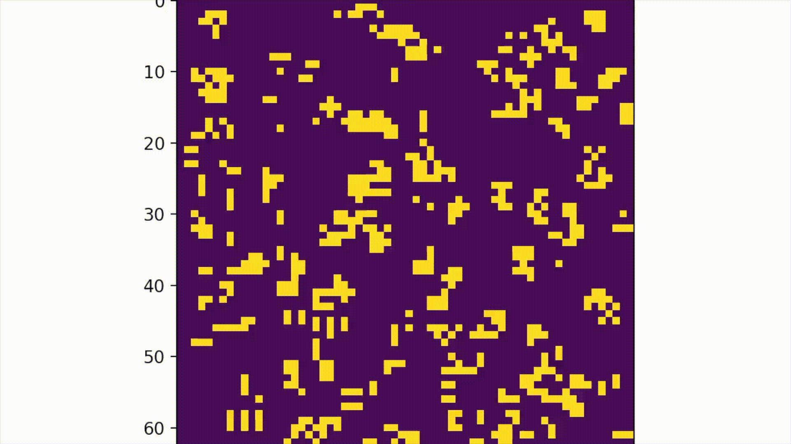

# Implementing Life in NumPy and SciPy

---
[Conway's Game of Life](http://www.scholarpedia.org/article/Game_of_Life) is a fascinating example of complex behavior of a system of cellular automata emerging from a set of simple rules. Programming this seemed to me like the 'Hello World!' of evolving systems, so here is my attempt - with some brief annotation - using basic matrix operations in Python.



## Importing Packages
First, I'm importing the packages I need for this script. Here I'm using some matplotlib functions to visualize the results of the simulation this script creates & runs, followed by NumPy, which is used for most operations in the simulation, and SciPy, which is used for the convolution operation.

```python
from matplotlib import animation
from matplotlib.animation import FFMpegWriter
import matplotlib.pyplot as plt
import numpy as np
import scipy as sp
```
## Set Up the Simulation
Next, I set the initialization parameters of the simulation.
```python
size = 64 # The length of either side of the game's square matrix
init_number = 750 # The number of cells to initialize as 'live'
generations = 1000 # The number of generations to run the game

if init_number > size * size:
    raise Exception("Number of cells to initialize cannot exceed the total number of cells in the space")
```
Now that the simulation's parameters have been set, I can set up the simulation as such:
```python
def setup_game(state, init_number):
    random_x_idxs = np.random.randint(1, state.shape[0], init_number)
    random_y_idxs = np.random.randint(1, state.shape[1], init_number)

    state[random_x_idxs, random_y_idxs] = 1
    return state
```
And now I have a sparse square matrix with some cells set to the value of 1 (here we use 0 to denote a dead cell and 1 to denote a live cell). This is the initial state of the simulation! 
## Define the System's Evolution
Now we need to evolve the state according to a set of rules. The rules we follow for this simulation are as follows:
1. Any live cell with fewer than two live neighbors dies, as if by underpopulation.
2. Any live cell with two or three live neighbors lives on to the next generation.
3. Any live cell with more than three live neighbors dies, as if by overpopulation.
4. Any dead cell with exactly three live neighbors becomes a live cell, as if by reproduction.

So, what we need to do is sum the number of live neighbors for each cell and then update the state of each cell. To avoid nested for-loops, here I use the SciPy 2-dimensional convolution function with a kernel which sums the number of live neighbors each cell has.
```python
def update_game(state):
    kernel = np.array([[1, 1, 1],
                        [1, 0, 1],
                        [1, 1, 1]])
    
    live_cells = state == 1
    dead_cells = state == 0

    new_state = sp.ndimage.convolve(state, 
                                    kernel, 
                                    mode='constant', 
                                    cval=0)
    born = (new_state == 3) & (state == 0)
    survive = ((new_state == 2) | (new_state == 3)) & (state == 1)
    state[:] = 0  # Reset state
    state[born | survive] = 1  # Apply born and survive rule

    return state
```
Now that we've defined the update rule for the system, we can set up an evolution function which orchestrates the game updates across n generations and saves the state at each timestep in the a 3-D tensor 'Generations'.

```python
def evolution(generations):
    state = np.zeros((size, size))
    state = setup_game(state, init_number)
    print(f'Life Initialized')

    Generations = np.zeros((size, size, generations+1))
    Generations[:, :, 0] = state
 
    for i in range(generations+1):
        state = update_game(np.copy(state))
        Generations[:, :, i] = state
    print(f'Sim Completed')
    return Generations
```
## Visualize the Simulation
Of course, we want to visualize the system's evolution. Here I use Matplotlib to create an MP4 video of our Generations tensor being plotted at each 'generation'.
```python
def plot(Generations):
    writer = FFMpegWriter(fps=20, bitrate=1800)    
    fig = plt.figure()
    img = plt.imshow(Generations[:, :, 0], animated = True)

    def update(i):
        img.set_array(Generations[:, :, i])
        return img,
    ani = animation.FuncAnimation(fig, update, frames = Generations.shape[2], blit = True)
    ani.save('Life.mp4', writer = writer)
    print(f'Video Saved')
```
## Run the Simulation
Now we need to call our evolution and plot functions...
```python
def main():
    Generations = evolution(generations)
    plot(Generations)
```
...and finally enable the script to run:
```python
if __name__ == '__main__':
    main()
```